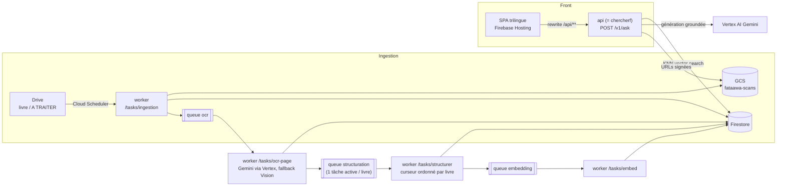

# Fataawa — Architecture cible sur Cloud Run

> Migration du pipeline Google Apps Script vers Node.js/TypeScript sur Cloud Run.
> Projet GCP : **`looker-studio-458310`** (région `us-central1`) — celui qui héberge déjà
> le service Cloud Run `chercherf`, Firestore et Firebase. **Tout se déploie dans ce
> projet** ; le service existant est réutilisé comme API publique (son URL continue de
> répondre pendant toute la migration), on lui adjoint un second service privé pour les
> traitements.

Document de discussion : les décisions sont argumentées, les points encore ouverts sont
listés en §10. Aucun code n'est écrit tant que ces choix ne sont pas validés.

---

## 1. Ce qu'on remplace

| Fichier GAS | Rôle actuel | Devient |
|---|---|---|
| `OCR_GEMINI.gs` | PNG « A TRAITER » → Gemini OCR → append Google Doc, déplacement de dossiers, quarantaine + mail, arrêt à 14 min | Tâches `ocr-page` (une tâche = une page) sur le worker ; état et texte en Firestore |
| `Creation_base_auto.gs` | Doc → split `--- [` → Gemini structure → Sheet par livre, gestion « SUITE », arrêt à 9 min | Tâches `structurer` **ordonnées par livre** via un curseur Firestore (voir §6) |
| `master_base.gs` | Sheet livre → MASTER_SHEET, dédup colonne A | Disparaît : upsert direct `fatwas/{id}` — la dédup devient l'ID du document |
| `Firestore.gs` | Master Sheet → POST `{action:"UPLOAD", secret_token}` vers Cloud Run, « ✅ EN LIGNE » colonne I | Disparaît : les fatwas naissent directement dans Firestore |
| `Code.gs` (`processUserQuestion`) | GAS orchestre le RAG : POST `{question}` → contexte → Gemini côté GAS → images **base64** via `DriveApp.getFilesByName()` | `POST /v1/ask` : retrieval + génération **côté serveur**, images en **URLs signées GCS** |
| `Index.html` / `JavaScript.html` / `Stylesheet.html` | Webapp HtmlService `ANYONE_ANONYMOUS`, exécutée avec les droits du déployeur | SPA statique sur **Firebase Hosting** (même UI trilingue FR/EN/AR, RTL, portée quasi telle quelle) |
| `CONFIG.gs` | Clés Gemini/Vision en dur, private key du SA Firebase en clair, « barillet rotatif » de clés | **Vertex AI** (auth IAM → zéro clé API), Secret Manager pour le résiduel éventuel |

Principes directeurs :

1. **L'état vit dans Firestore** — plus jamais dans des noms de dossiers (`[TERMINÉ]`),
   des Google Docs tampons ou des colonnes de Sheet.
2. **Chaque étape est idempotente et rejouable** — une tâche qui replante ne duplique rien.
3. **Plus aucune limite de temps à contourner** — les chronos 9/14 min disparaissent,
   le découpage se fait par unité de travail (la page), pas par durée.
4. **Moindre privilège** — un service account par service, ingress fermé pour le worker.
5. **Migration « strangler »** — les robots GAS tournent jusqu'à ce que leur maillon soit
   remplacé et vérifié ; on coupe trigger par trigger (§9).

---

## 2. Vue d'ensemble



Deux services Cloud Run, un seul dépôt :

- **`chercherf`** (existant, public) → devient l'**API** : `/v1/ask`, `/v1/images/:id`
  (redirection URL signée), routes legacy conservées le temps de la migration
  (`{question}` → `{contexte}`, `{action:"UPLOAD"}`).
- **`fataawa-worker`** (nouveau, **ingress interne uniquement**) : `/tasks/ingestion`,
  `/tasks/ocr-page`, `/tasks/structurer`, `/tasks/embed`. Invoqué exclusivement par
  Cloud Tasks / Cloud Scheduler avec un jeton OIDC.

Même image, deux points d'entrée : la séparation isole les droits (le worker a accès
Drive/GCS/Vertex en écriture, l'API n'a que Firestore-lecture + signature GCS + Vertex)
et permet des réglages distincts (concurrence, CPU, timeout 15 min côté worker).

---

## 3. Stockage des scans — GCS ; Drive reste la porte d'entrée

**Décision : bucket GCS `fataawa-scans`, un préfixe par livre
(`{livreId}/{numeroPage}.png`). Drive reste l'endroit où les humains déposent les scans.**

- L'ingestion (Cloud Scheduler → `/tasks/ingestion`, toutes les 15 min) liste les dossiers
  « A TRAITER » via l'API Drive, copie chaque nouveau PNG vers GCS (idempotent : le
  `fileId` Drive et le SHA-256 sont mémorisés sur le document `pages/`), crée le document
  Firestore, enfile la tâche OCR. Le déplacement Drive « A TRAITER » → « TRAITES » est
  **conservé comme signal visuel** pour les humains, mais n'est plus porteur d'état : la
  vérité est dans Firestore, et une page déjà ingérée n'est jamais retraitée même si le
  fichier est remis dans le dossier.
- La quarantaine devient un **statut** (`QUARANTAINE` sur le document page) + une alerte
  (§8), plus un dossier.
- Le front ne reçoit **plus jamais de base64** : l'API renvoie des URLs signées GCS
  (durée ~1 h) pour les images de pages citées en source. Fini le
  `DriveApp.getFilesByName()` (recherche globale par nom !) : la fatwa référence
  directement ses pages, qui portent leur chemin GCS.

*Option long terme (hors périmètre migration)* : upload direct depuis une UI admin vers
GCS (URL signée d'upload) + Eventarc `object.finalize`, ce qui supprimerait Drive. On ne
le fait pas maintenant : Drive est l'interface connue des opérateurs, coût de changement
inutile pendant la migration.

---

## 4. File d'attente & orchestration — Cloud Tasks (+ Scheduler, + Jobs)

**Décision : Cloud Tasks, pas Pub/Sub.** Il n'y a ni fan-out ni consommateurs multiples ;
ce qu'il faut, c'est du **lissage de débit, des retries pilotés et de la dédup** — le cœur
de métier de Cloud Tasks :

| Queue | Débit / concurrence | Retries | Rôle |
|---|---|---|---|
| `ocr` | `maxDispatchesPerSecond` calé sur le quota Gemini du projet | 3 tentatives, backoff expo | remplace **proprement le « barillet rotatif »** : c'est la queue qui absorbe les 429, plus une rotation de clés |
| `structuration` | 1 tâche active **par livre** (nom de tâche déterministe `livre:{id}:{curseur}` → dédup native) | 3 tentatives | garantit l'ordre des pages (§6) |
| `embedding` | large | 5 tentatives | isole les échecs d'embedding de la structuration |

- **Cloud Scheduler** : déclenche l'ingestion périodique (remplace les triggers temporels
  GAS) et un balayage horaire « rattrapage » qui ré-enfile les pages restées `EN_COURS`
  trop longtemps (crash récupéré).
- **Cloud Run Jobs** : pour les one-shot longs — backfill initial depuis le MASTER_SHEET,
  ré-OCR complet d'un livre, ré-embedding global après changement de modèle.
- Idempotence : la tâche OCR porte `pageId` et vérifie le statut avant d'agir ; l'upsert
  fatwa est keyed par `numero_fatwa` normalisé. Rejouer une tâche est toujours sans effet
  de bord.
- Échec définitif (tentatives épuisées, détecté via `X-CloudTasks-TaskRetryCount`) →
  statut `QUARANTAINE` + alerte. Équivalent du mail actuel, mais tracé et requêtable.

---

## 5. Base de données — Firestore seul, y compris le vector search

**Décision : Firestore (déjà dans le projet) devient l'unique source de vérité et
remplace Docs + Sheets + MASTER_SHEET + noms de dossiers.**

```text
livres/{livreId}
  titre, dossierDriveId, statut: EN_COURS | TERMINE
  nbPages, nbPagesOcr, nbFatwas
  curseurStructuration: 12          // dernière page structurée (ordre strict)
  fatwaOuverte: { texte, sujet… } | null   // fatwa coupée en fin de page (« SUITE »)

livres/{livreId}/pages/{numeroPage}       // ID = numéro zéro-paddé → tri lexical = ordre de lecture
  gcsPath, driveFileId, sha256
  statutOcr: A_TRAITER | EN_COURS | TRAITE | QUARANTAINE
  texteOcr, moteur: GEMINI | VISION, tentatives, derniereErreur, ocrAt

fatwas/{numeroFatwaNormalise}             // ID = dédup (remplace la colonne A du master)
  livreId, numero, sujetPrincipal, sousSujet, texteComplet
  pages: [{ livreId, numeroPage, gcsPath }]   // → URLs signées côté API
  embedding: Vector<768>
  statut: STRUCTUREE | EN_LIGNE, majAt
```

- **Vector search : Firestore natif** (`findNearest`, index vectoriel, cosine).
  Embeddings **`gemini-embedding-001` via Vertex, réduits à 768 dimensions**
  (multilingue, bon sur l'arabe, et 768 reste sous la limite Firestore de 2048 tout en
  divisant le coût de stockage). Pour un corpus de l'ordre de 10³–10⁵ fatwas c'est
  largement suffisant ; on ne sort l'artillerie Vertex AI Vector Search que si le corpus
  dépasse ~100 k documents (bascule possible sans changer le schéma, l'embedding est déjà
  stocké).
- Les **Sheets ne sont plus dans le chemin de données**. Si un export lisible par les
  humains reste utile, c'est un job d'export **à sens unique** Firestore → Sheet, jamais
  l'inverse. (Question ouverte, §10.)
- Le « ✅ EN LIGNE » colonne I devient le champ `statut` de la fatwa.

---

## 6. Le point délicat : la continuité « SUITE » entre pages

L'OCR est parallélisable à volonté, **la structuration ne l'est pas au sein d'un livre** :
une fatwa peut commencer page N et finir page N+1. Le design :

1. Les pages d'un livre sont structurées **strictement dans l'ordre**, pilotées par
   `curseurStructuration` sur le document livre.
2. La tâche `structurer(livreId)` avance le curseur tant que la page suivante est
   `statutOcr: TRAITE` : elle envoie à Gemini le texte de la page **plus** l'éventuelle
   `fatwaOuverte` héritée de la page précédente ; le modèle rend les fatwas complètes
   *et* le fragment restant ouvert, persistés en une **transaction Firestore**
   (fatwas + curseur + fatwaOuverte = atomique).
3. Si la page suivante n'est pas encore OCRisée, la tâche se termine ; c'est la fin de
   l'OCR de cette page qui ré-enfilera `structurer`. Le nom de tâche déterministe
   (`livre:{id}:{curseur}`) garantit qu'il n'y a jamais deux structurations concurrentes
   du même livre — les livres, eux, avancent en parallèle.
4. Une page en `QUARANTAINE` **bloque le curseur** de son livre (choix assumé : on
   préfère un livre en pause qu'une fatwa recousue de travers). L'alerte §8 pointe la
   page fautive ; l'admin la corrige (ré-OCR ou saisie) et le curseur repart.

C'est la transposition propre de ce que `masterSupervisor()` fait aujourd'hui à coups de
`split("--- [")` et de marqueurs « SUITE » dans un Google Doc.

---

## 7. IA — Vertex AI, un seul modèle, zéro clé API

- **Tous les appels Gemini passent par Vertex AI** dans `looker-studio-458310` :
  authentification IAM du service account, **plus aucune clé API** → le barillet
  `getCleApi()/changerCleApi()` disparaît, remplacé par le lissage Cloud Tasks + backoff
  (`Retry-After` honoré) + quota projet.
- **Un seul ID de modèle**, dans la config (`gemini-3.1-flash-lite`) — l'incohérence
  `-preview` d'`askGeminiToStructure()` disparaît. Changer de modèle = un changement de
  config, suivi d'un job de ré-embedding si c'est le modèle d'embedding qui change.
- **Fallback Cloud Vision conservé** pour les `finishReason: RECITATION`, via la client
  library (auth IAM aussi, la clé Vision en dur meurt).
- **Sorties structurées validées** : `responseSchema` côté Gemini + validation zod côté
  Node ; réponse invalide = retry avec feedback, puis quarantaine. (Aujourd'hui : parse
  optimiste du JSON.)
- Le system prompt de grounding strict du front est conservé, mais exécuté **côté API** ;
  le front ne voit plus que le JSON final
  `{reponse_utilisateur, suggestions_cliquables, sources_utilisees[]}` où `url_image` est
  une URL signée.

---

## 8. Sécurité, secrets, observabilité

**À faire avant toute autre chose (phase 0, indépendante du code)** :

- **Révoquer** : les clés Gemini du barillet, la clé Cloud Vision, et la **private key du
  service account Firebase** actuellement en clair dans `CONFIG.gs` (rotation côté IAM).
  Les remplaçantes temporaires pour GAS vont dans Script Properties, plus jamais dans le
  source.
- Le dépôt Git ne contiendra **jamais** ces fichiers : le code GAS n'est archivé qu'après
  purge de `CONFIG.gs`.

Cible :

- **Worker** : ingress interne, invocation uniquement via OIDC (Cloud Tasks/Scheduler).
  Le `secret_token` maison de la route UPLOAD disparaît avec elle en fin de migration.
- **API publique** : Firebase Hosting devant (rewrite `/api/**` → Cloud Run, même
  origine, pas de CORS), **App Check** sur le front + **rate limiting par IP** dans l'API
  (token bucket Firestore/mémoire) + `max-instances` bas — l'endpoint actuel n'a ni auth
  ni limite et consomme les quotas du déployeur.
- **Routes admin** (relancer un livre, vider une quarantaine…) : Firebase Auth (compte
  Google) + allowlist d'e-mails vérifiée dans un middleware.
- **Service accounts dédiés** : `sa-api` (Firestore lecture, signature GCS, Vertex),
  `sa-worker` (Drive lecture + move, GCS écriture, Firestore écriture, Vertex, Vision).
- **Observabilité** : logs structurés (pino) avec `livreId`/`pageId` sur chaque ligne,
  Error Reporting, métrique log-based sur les mises en quarantaine → **alerte e-mail
  Cloud Monitoring** (remplace `MailApp`), petit dashboard (pages/h, taux fallback
  Vision, profondeur des queues).
- **Qualité** : TypeScript strict, zod aux frontières (payloads Gemini, requêtes front),
  tests unitaires sur le découpage/continuité (§6) avec transcripts réels comme
  fixtures, CI GitHub Actions (lint + tests + déploiement gcloud via Workload Identity
  Federation — pas de clé de SA dans GitHub non plus).

---

## 9. Plan de migration (strangler, sans interruption de service)

| Phase | Contenu | On coupe quoi côté GAS |
|---|---|---|
| **0 — Hygiène** (immédiat) | Révocation/rotation des clés et de la private key ; clés temporaires en Script Properties ; export de sauvegarde des Sheets/Docs | rien |
| **1 — Socle + OCR** | Repo TS (monorepo `apps/api`, `apps/worker`, `packages/core`), CI, bucket GCS, schéma Firestore, ingestion Drive→GCS, queue `ocr`, OCR Vertex + fallback Vision | trigger `processGeminiProduction50()` |
| **2 — Structuration** | Queue `structuration` + curseur/`fatwaOuverte`, upsert `fatwas/`, embeddings ; **backfill one-shot** du MASTER_SHEET existant vers `fatwas/` (Cloud Run Job) | triggers `masterSupervisor()`, `pousserVersMaster()`, `exporterSheetVersCloudRun()` |
| **3 — API + Front** | `/v1/ask` complet (retrieval + génération + URLs signées) déployé **sur `chercherf`** en gardant les routes legacy ; portage de la SPA sur Firebase Hosting ; bascule des utilisateurs | webapp GAS (`doGet`) |
| **4 — Nettoyage** | Suppression des routes legacy (`{question}`→`{contexte}`, `UPLOAD`+`secret_token`), resserrage quotas/alerting, archivage du projet GAS | tout le reste |

Chaque phase laisse le système **entièrement fonctionnel** : tant que la phase 3 n'est pas
basculée, le front GAS continue d'interroger la route legacy de `chercherf`, qui répond
depuis les nouvelles données.

Coûts : tout est serverless et scale-to-zero ; aux volumes actuels (OCR flash-lite, KNN
Firestore, GCS en Go), l'ordre de grandeur reste celui d'aujourd'hui — quelques dizaines
d'euros/mois, dominés par les appels Gemini déjà payés.

---

## 10. Questions ouvertes avant d'écrire le code

1. **Volumétrie** : combien de livres / pages / fatwas aujourd'hui, et visés à 12 mois ?
   (Valide le choix Firestore KNN vs Vertex Vector Search, et le débit de la queue `ocr`.)
2. **Sheets** : garde-t-on un export lecture seule Firestore → Sheet pour le confort des
   opérateurs, ou le petit écran admin suffit-il ?
3. **Front public** : reste-t-il totalement anonyme (App Check + rate limit), ou veut-on
   un login (même léger) ?
4. **Nom du service** : on garde `chercherf` (URL inchangée, zéro bascule DNS) — OK, ou
   on préfère renommer proprement (`fataawa-api`) avec une redirection ?
5. **TypeScript** confirmé ? (Fortement recommandé vu l'absence actuelle de typage/tests.)
6. **Vertex AI** : confirmer que le billing du projet permet d'activer l'API Vertex —
   c'est la clef de voûte de la disparition des clés API.
